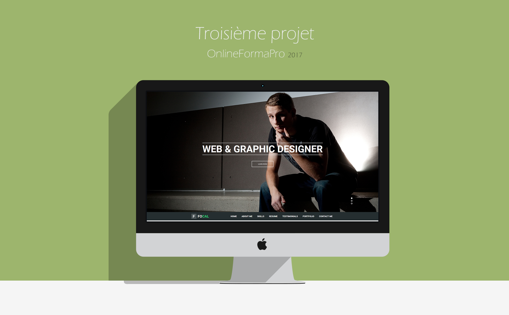

<h2>Projet 3</h2>

3ème Projet au sein du centre de formation OnlineFormaPro  

<h4>La maquette à intégrer:</h4>

<h3>Exercice:</h3>
<ol>
  <li>Réaliser un site à partir d'une maquette.</li>
  <li>Ajouter des animations. Qui pour nous sont:
      <ul>
          <li>Affichage du pourcentage des barres de skills au passage de la souris.</li>
          <li>Changement de la photo dans le About Me au passage de la souris.</li>
      </ul>
  </li>
</ol>

Le site n'est pas responsive car ce n'était pas le but de l'éxercice.

Projet réalisé par: <a href="http://clairegiacomel.com/">Claire Giacomel<a>, Ponçon Elodie, Bojama Mélissa, Sautebin Anthony.

<h4>Résultat:</h4>

Code source ci dessus
